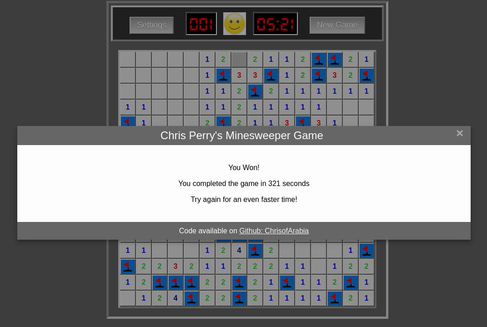

# WDI_PROJECT_1 - 'Minesweeper'
This was my first project for my Web Development Immersive course (WDI_24) at General Assembly London

I chose the game Minesweeper as I felt it represented an interesting range of challenges around the logic needed to implement the game play.

##Aims
- Complete a re-creation of the ‘Minesweeper’ game found on MS Windows operating systems
- Ensure it would play on modern browsers using a mouse with left/right buttons
- Style it to replicate the ‘classic’ game look and feel

##Successes
- The game was written in ‘vanilla’ JS with no use of jQuery or 3rd Party libraries
- Grasping the core concept of how the game logic worked and planning the pseudo code around that
- Extending practical working knowledge of functions and how they behave
- The styling worked out well

##Challenges
- Accessing variable values in the form required
- Learning how a recursive function has to be structured
- Early use of jQuery was refactored out as it was blocking progress
- Keeping the code ‘DRY’

##Future Development
- Extend use of OOP
- Reduce the size of the codebase
- Add other grid size options (9x9, 30x16)
- Make the game playable on a touchscreen or mobile devices
- Convert to a Progressive Web App (PWA)

##Live Game Version
- a live version of the game can be found and played at ['Minesweeper'](https://frozen-eyrie-56010.herokuapp.com/)
